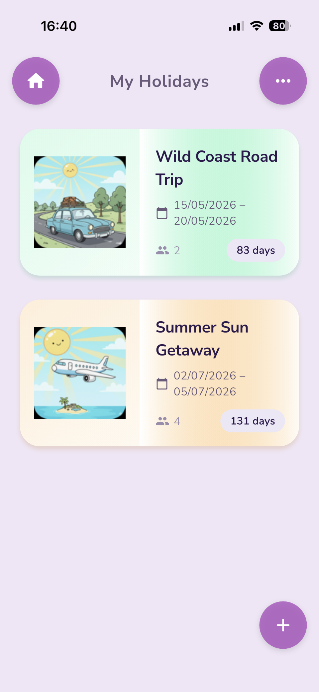
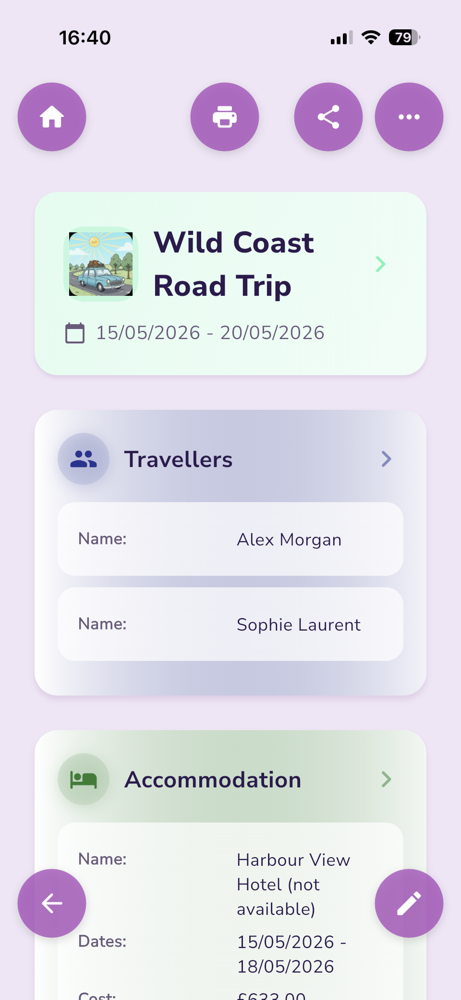
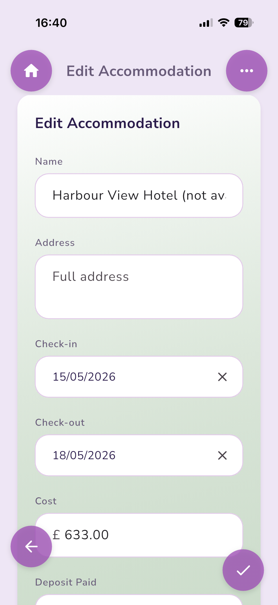
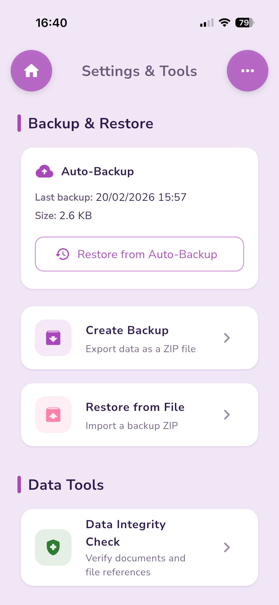

# MyHolidays

An offline-first holiday and vacation planner — your **travel wallet** for keeping every trip organised in one place.

Plan holidays, track travellers, accommodation, travel legs, car hire, activities, and day-by-day itineraries. Attach documents, export to PDF, and back up everything to a ZIP file.

## Features

**Holiday Planning**
- Create and manage multiple holidays with dates, destinations, and notes
- Colour-coded sections for quick visual navigation
- Print or share a full holiday summary as PDF

**Travellers**
- Add traveller profiles with passport details and emergency contacts
- Link travellers to specific holidays

**Accommodation**
- Hotel, apartment, or villa details with check-in/check-out dates
- Address, booking reference, and cost tracking

**Travel**
- Outbound, return, and inter-resort travel legs
- Flight, train, bus, ferry, taxi, or car modes
- Departure and arrival dates, times, and carrier details

**Car Hire**
- Pickup and dropoff locations, dates, and times
- Company, drivers, deposit, and total cost

**Activities**
- Excursions, tours, and events with date, time, and location
- Booking references and cost tracking

**Itinerary**
- Day-by-day planner with numbered days
- Morning, afternoon, and evening slots with notes

**Document Management**
- Attach photos and files to any section (camera, gallery, or file picker)
- View and manage documents per holiday

**Backup & Restore**
- Full backup to ZIP file (database + all attachments)
- Automatic backup when the app goes to background (max once every 4 hours)
- Restore from any backup file
- Data integrity checking

## Privacy

MyHolidays stores all data locally on your device. No accounts, no cloud sync, no tracking. The only network request is fetching fonts from Google Fonts.

## Support

If you have a question or found a bug, please [open an issue](https://github.com/bradymd/myholidays/issues).

If you find the app useful, you can support development via the in-app tip jar or [donate via PayPal](https://paypal.me/bradymd).

Visit the [MyHolidays Support Page](https://bradymd.github.io/myholidays/) for more information.

## Screenshots

  

<table>
  <tr>
    <td align="center"><b>Trip Summary</b> </td>
    <td align="center"><b>Edit Accommodation</b> </td>
    <td align="center"><b>Settings & Tools</b> </td>
  </tr>
</table>

## Download

- **iOS** — Available on the App Store via TestFlight *(coming soon)*
- **Android** — APK available from [Releases](https://github.com/bradymd/myholidays/releases)
